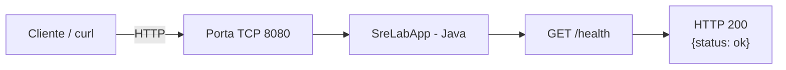
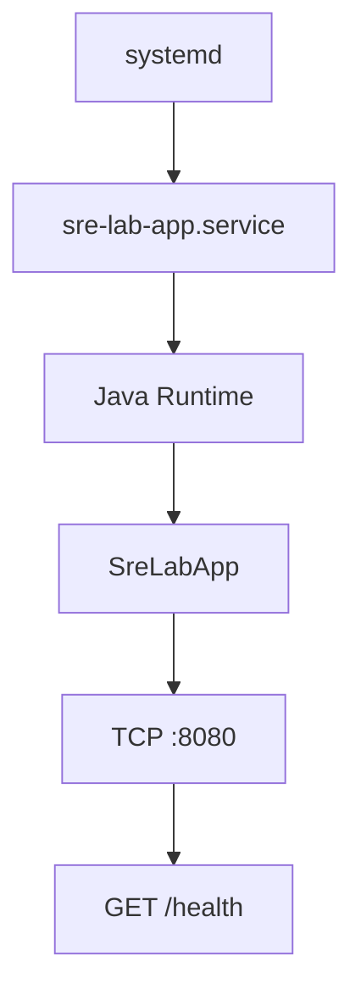
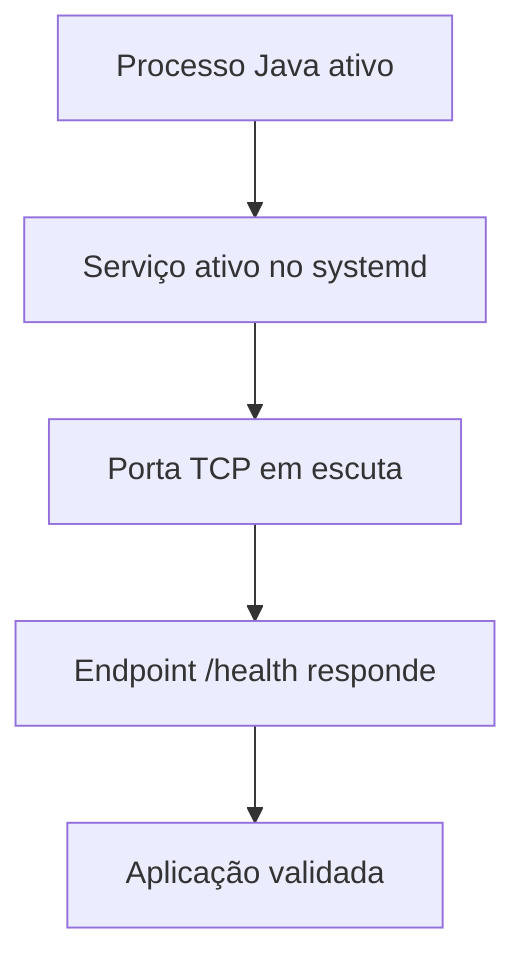

# Arquitetura do Linux Production Troubleshooting Lab

## Visão Geral

O projeto utiliza uma aplicação HTTP simples desenvolvida em Java como alvo para os experimentos de troubleshooting.

A aplicação é executada como um serviço gerenciado pelo `systemd` e disponibiliza um endpoint de health check na porta `8080`.



## Gerenciamento do Serviço

A aplicação pode ser executada manualmente durante testes ou gerenciada pelo `systemd`.

No cenário utilizado nos incidentes de serviço, o fluxo é:



O arquivo de serviço utilizado como template está disponível em:

```text
app/sre-lab-app.service
```

## Componentes

| Componente            | Responsabilidade                               |
| --------------------- | ---------------------------------------------- |
| `SreLabApp`           | Aplicação Java utilizada como alvo dos testes  |
| `systemd`             | Gerenciamento do ciclo de vida do serviço      |
| `sre-lab-app.service` | Definição do serviço da aplicação              |
| TCP `8080`            | Porta esperada para acesso à aplicação         |
| `/health`             | Endpoint utilizado para validação da aplicação |
| `curl`                | Teste de conectividade e resposta HTTP         |
| `ss`                  | Inspeção das portas TCP em escuta              |
| `journalctl`          | Investigação dos logs do serviço               |

## Fluxo de Validação

Uma aplicação em execução não é considerada saudável apenas porque existe um processo Java ativo.

A validação utilizada no laboratório considera diferentes camadas:



Esse modelo permite diferenciar problemas de processo, serviço, configuração de porta e disponibilidade HTTP.

## Relação com os Incidentes

A mesma arquitetura foi utilizada para investigar diferentes tipos de falha.

| Incidente | Camada investigada      |
| --------- | ----------------------- |
| INC-001   | Armazenamento / I/O     |
| INC-002   | CPU                     |
| INC-003   | Memória                 |
| INC-004   | Serviço / processo Java |
| INC-005   | Rede local / porta TCP  |

Os relatórios das investigações estão disponíveis em:

```text
incidents/
```

As evidências técnicas estão disponíveis em:

```text
evidence/
```

